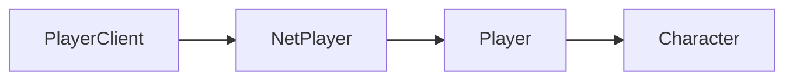

# Character

Character-related APIs. To use these, you must first have a reference to a character, such as the local player's character. Example:

```lua
local character = Players.Local()
local localChar = playerClient:GetCharacter()
```


## Player Class Hierarchy

The diagram shows the inheritance hierarchy of player-related classes. To navigate between classes:
- Get a `PlayerClient` using `Players.Local()`
- Get the `NetPlayer` from a `PlayerClient` using `:GetNetPlayer()`
- Get the `Player` from a `NetPlayer` using `:GetGamePlayer()`
- Get the `Character` from a `Player` using `:GetCharacter()`




## Class Instance Methods

#### `Character:GetPosition(): vec3`

Returns the Character's position in the world.


#### `Character:SetPosition(pos: vec3)`

Sets the Character's position in the world.


#### `Character:SetLinearVelocity(velocity: vec3)`

Sets the Character's linear velocity.


#### `Character:GoRagdoll()`

Forces the Character into the ragdoll state.

#### `Character:IsRagdolling(): boolean`

Returns true if the Character is currently ragdolling, false otherwise.

#### `Character:IsGettingUpFromRagdoll(): boolean`

Returns true if the Character is currently getting up from ragdoll, false otherwise.


#### `Character:UsingParachute(): boolean`

Returns true if the Character is using a parachute, false otherwise.


#### `Character:UsingWingsuit(): boolean`

Returns true if the Character is using a wingsuit, false otherwise.


#### `Character:GetHP(): number`

Returns the amount of health that the character has. Default max health is 800, and minimum health is 0 when dead.


#### `Character:GetPlayer(): Player`

Returns the [Player](/client-api/player) associated with this Character.


#### `Character:GetBonePosition(bone: Bone): vec3`

Gets the world position of a specific bone on a character. Refer to [Bone](/client-api/bone) for a list of bones to use and example usage.

