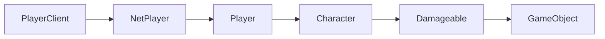

import { InheritedComponent } from '../../src/components/InheritedComponent';

# Character

Character-related APIs. To use these, you must first have a reference to a character, such as the local player's character. Example:

```lua
local character = Players.Local()
local localChar = playerClient:GetCharacter()
```


## Player Class Hierarchy

The diagram shows the inheritance hierarchy of player-related classes. To navigate between classes:
- Get a `PlayerClient` using `Players.Local()`
- Get the `NetPlayer` from a `PlayerClient` using `:GetNetPlayer()`
- Get the `Player` from a `NetPlayer` using `:GI()`
- Get the `Character` from a `Player` using `:GetCharacter()`




## Class Instance Methods

<InheritedComponent className="Character" />


