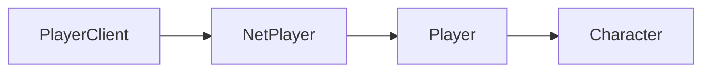

# NetPlayer

This is the client-side class for [NetPlayer](/shared-api/netplayer). It has all the same methods and properties as the shared class, plus the following on this page.

## Player Class Hierarchy

The diagram shows the inheritance hierarchy of player-related classes. To navigate between classes:
- Get a `PlayerClient` using `Players.Local()`
- Get the `NetPlayer` from a `PlayerClient` using `:GetNetPlayer()`
- Get the `Player` from a `NetPlayer` using `:GetGamePlayer()`
- Get the `Character` from a `Player` using `:GetCharacter()`

## Class Instance Methods

#### `NetPlayer::GetGamePlayer(): Player`

Returns the [Player](/client-api/player) associated with this NetPlayer.
