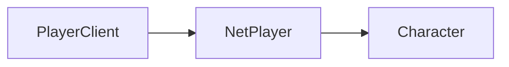

# NetPlayer

This is the client-side class for [NetPlayer](/shared-api/netplayer). Inherits from [NetPlayerBase](/shared-api/netplayerbase). It has all the same methods and properties as the shared class, plus the following on this page.

## Player Class Hierarchy

The diagram shows the inheritance hierarchy of player-related classes. To navigate between classes:
- Get a `PlayerClient` using `Players.Local()`
- Get the `NetPlayer` from a `PlayerClient` using `:GetNetPlayer()`
- Get the `Character` from a `NetPlayer` using `:GetCharacter()`




## Class Instance Methods

### Player State Methods

#### `NetPlayer:GetAimPosition(): vec3`

Returns the player's current aim position, based on the weapon they have equipped. For example, if the player does not have a weapon, this position will only reach out as far as the grappling hook goes (about 80m).

**Returns:** vec3 - The position the player is aiming at

**Example:**
```lua
local aimPos = player:GetAimPosition()
print("Player is aiming at: " .. tostring(aimPos))
```

#### `NetPlayer:GoRagdoll(): void`

Forces the Character into the ragdoll state.

**Example:**
```lua
-- Force player into ragdoll
player:GoRagdoll()
```

#### `NetPlayer:IsRagdolling(): boolean`

Returns true if the Character is currently ragdolling, false otherwise.

**Returns:** boolean - true if the character is ragdolling, false otherwise

**Example:**
```lua
if player:IsRagdolling() then
    print("Player is ragdolling")
end
```

#### `NetPlayer:IsGettingUpFromRagdoll(): boolean`

Returns true if the Character is currently getting up from ragdoll, false otherwise.

**Returns:** boolean - true if the character is getting up from ragdoll, false otherwise

**Example:**
```lua
if player:IsGettingUpFromRagdoll() then
    print("Player is getting up from ragdoll")
end
```

#### `NetPlayer:UsingParachute(): boolean`

Returns true if the Character is using a parachute, false otherwise.

**Returns:** boolean - true if the character is using a parachute, false otherwise

**Example:**
```lua
if player:UsingParachute() then
    print("Player is using parachute")
end
```

#### `NetPlayer:UsingWingsuit(): boolean`

Returns true if the Character is using a wingsuit, false otherwise.

**Returns:** boolean - true if the character is using a wingsuit, false otherwise

**Example:**
```lua
if player:UsingWingsuit() then
    print("Player is using wingsuit")
end
```

### Player Information Methods

#### `NetPlayer:GetPlayer(): Player`

Returns the Player associated with this Character.

**Returns:** Player - The Player instance associated with this character

**Example:**
```lua
local player = netPlayer:GetPlayer()
print("Associated player: " .. player:GetNick())
```

#### `NetPlayer:GetBonePosition(bone: Bone): vec3`

Gets the world position of a specific bone on a character.

**Parameters:**
- `bone: Bone` - The bone to get the position of

**Returns:** vec3 - The world position of the specified bone

**Example:**
```lua
local headPos = player:GetBonePosition(Bone.Head)
print("Player head position: " .. tostring(headPos))
```

#### `NetPlayer:GetVehicle(): Vehicle | nil`

Returns the Vehicle instance that the character is currently in. Returns nil if the character is not in a vehicle.

**Returns:** Vehicle | nil - The vehicle the character is in, or nil if not in a vehicle

**Example:**
```lua
local vehicle = player:GetVehicle()
if vehicle then
    print("Player is in vehicle: " .. vehicle:GetId())
else
    print("Player is not in a vehicle")
end
```

### Visual Effect Methods

#### `NetPlayer:SetGhostMode(enabled: bool): void`

Enables or disables ghost mode. When ghost mode is enabled, all collisions will be disabled for the character, allowing them to pass through entities, objects, and terrain.

**Parameters:**
- `enabled: bool` - Whether to enable or disable ghost mode

**Example:**
```lua
-- Enable ghost mode
player:SetGhostMode(true)

-- Disable ghost mode
player:SetGhostMode(false)
```

#### `NetPlayer:SetCloaked(enabled: bool): void`

Enables or disables cloaked mode. When cloaked mode is enabled, the character will become mostly invisible with a shine on them.

**Parameters:**
- `enabled: bool` - Whether to enable or disable cloaked mode

**Example:**
```lua
-- Enable cloaked mode
player:SetCloaked(true)

-- Disable cloaked mode
player:SetCloaked(false)
```

#### `NetPlayer:SetOpacity(opacity: number): void`

Sets the opacity of the character. Takes a value from 0-1 where 0 means invisible and 1 means fully opaque.

**Parameters:**
- `opacity: number` - The opacity value (0-1)

**Example:**
```lua
-- Make player semi-transparent
player:SetOpacity(0.5)

-- Make player fully visible
player:SetOpacity(1.0)

-- Make player invisible
player:SetOpacity(0.0)
```

### Targeting Methods

#### `NetPlayer:GetGrappleTargetObject(): NetObject | nil`

Returns the object that the player is targeting with their grappling hook, or nil if there is none.

**Returns:** NetObject | nil - The object being targeted with the grappling hook, or nil if none

**Example:**
```lua
local target = player:GetGrappleTargetObject()
if target then
    print("Player is grappling towards: " .. target:GetType())
else
    print("Player is not grappling towards anything")
end
```
