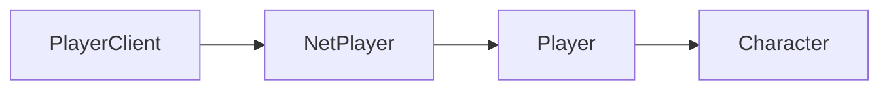

# Player

Player-related APIs. To use these, you must first have a reference to a player, such as the Local Player. You can get a reference to the Local Player like so:

```lua
local playerClient = Players.Local()
local localPlayer = playerClient:GI()
```

## Player Class Hierarchy

The diagram shows the inheritance hierarchy of player-related classes. To navigate between classes:
- Get a `PlayerClient` using `Players.Local()`
- Get the `NetPlayer` from a `PlayerClient` using `:GetNetPlayer()`
- Get the `Player` from a `NetPlayer` using `:GI()`
- Get the `Character` from a `Player` using `:GetCharacter()`




### Class Instance Methods

#### `Player:GetCharacter(): Character`

Returns the Player's [Character](/client-api/character).

#### `Player:GetAimPosition(): vec3`

Returns the player's current aim position, based on the weapon they have equipped. For example, if the player does not have a weapon, this position will only reach out as far as the grappling hook goes (about 80m).