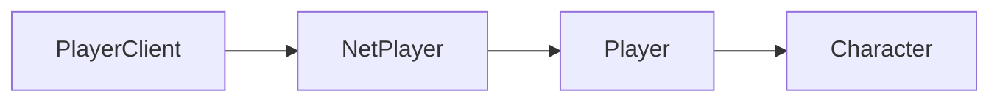

# Player

Player-related APIs. To use these, you must first have a reference to a player, such as the Local Player. You can get a reference to the Local Player like so:

```lua
local playerClient = Players.Local()
local localPlayer = playerClient:GetGamePlayer()
```

## Player Class Hierarchy

The diagram shows the inheritance hierarchy of player-related classes. To navigate between classes:
- Get a `PlayerClient` using `Players.Local()`
- Get the `NetPlayer` from a `PlayerClient` using `:GetNetPlayer()`
- Get the `Player` from a `NetPlayer` using `:GetGamePlayer()`
- Get the `Character` from a `Player` using `:GetCharacter()`




### Class Instance Methods

#### `Player:GetCharacter(): Character`

Returns the Player's [Character](/client-api/character).

#### `Player:EnableAbility(ability: Ability)`

Enables an ability for a given Player. `ability` must be one of these abilities from the global [`Ability` table](/client-api/ability).

Example of enabling the local player's ability to use the wingsuit:
```lua
Players.Local():GetGamePlayer():EnableAbility(Ability.Wingsuit)
```


#### `Player:DisableAbility(ability: Ability)`

Disables an ability for a given Player. `ability` must be one of the abilities from the global [`Ability` table](/client-api/ability).

Example of disabling the local player's ability to use the grappling hook:

```lua
Players.Local():GetGamePlayer():EnableAbility(Ability.GrapplingHook)
```

#### `Player:IsAbilityEnabled(ability: Ability)`

Returns true if the given ability is enabled for the Player, false if disabled. `ability` must be one of the abilities from the global `Ability` table (shown above).


#### `Player:GetAimPosition(): vec3`

Returns the player's current aim position, based on the weapon they have equipped. For example, if the player does not have a weapon, this position will only reach out as far as the grappling hook goes (about 80m).