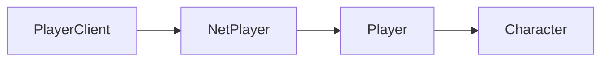

import { InheritedComponent } from '../../src/components/InheritedComponent';

# PlayerClient

A player's client instance. Inherits from the [PlayerClient](/shared-api/playerclient) class. You can use this class to get information about the player, such as their Character and NetPlayer.


## Player Class Hierarchy

The diagram shows the inheritance hierarchy of player-related classes. To navigate between classes:
- Get a `PlayerClient` using `Players.Local()`
- Get the `NetPlayer` from a `PlayerClient` using `:GetNetPlayer()`
- Get the `Player` from a `NetPlayer` using `:GetGamePlayer()`
- Get the `Character` from a `Player` using `:GetCharacter()`





Example usage:


```lua
local playerClient = Players.Local()
```

## Class Instance Methods

<InheritedComponent className="PlayerClient_Client" />

### Class Methods

#### `PlayerClient:GetCharacter(): Character`

Returns the [Character](/client-api/character) associated with this PlayerClient.

#### `PlayerClient:GetNetPlayer(): NetPlayer`

Returns the [NetPlayer](/client-api/netplayer) associated with this PlayerClient.

#### `PlayerClient:GetGamePlayer(): Player`

Returns the [Player](/client-api/player) associated with this PlayerClient.