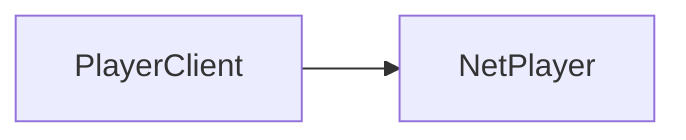

import { InheritedComponent } from '../../src/components/InheritedComponent';

# NetPlayer

This is the server-side class for [NetPlayer](/shared-api/netplayer). It has all the same methods and properties as the shared class, plus the following on this page.

## Player Class Hierarchy

The diagram shows the inheritance hierarchy of player-related classes. To navigate between classes:
- Get a `PlayerClient`
- Get the `NetPlayer` from a `PlayerClient` using `:GetNetPlayer()`




## Class Instance Methods

<InheritedComponent className="NetPlayer_Server" />

### Class Methods

#### `NetPlayer:Respawn(position: vec3, health: number, max_health: number)`

Respawns the player at the given position with the given health and max health.

**Parameters:**
- `position` (vec3): The position to respawn the player at
- `health` (number): The health to set for the respawned player
- `max_health` (number): The maximum health to set for the respawned player

**Example:**
```lua
player:Respawn(vec3(0, 0, 0), 100, 100)
```

#### `NetPlayer:GiveWeapon(string name, int ammo, WeaponSlot slot)`

Gives a weapon to the player with specified ammo count. View the full list of [weapons here](/reference/weapons-list).

#### `NetPlayer:RemoveWeapon(WeaponSlot slot)`

Removes a weapon from the specified [weapon slot](/shared-api/weaponslot).

#### `NetPlayer:Teleport(pos: vec3)`

Teleports the player to a specific position.

**Parameters:**
- `pos` (vec3): The position to teleport the player to

**Example:**
```lua
player:Teleport(vec3(0, 0, 0))
```
