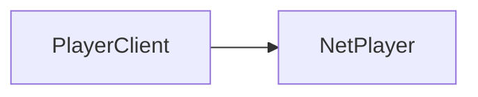

# PlayerClient

A player's client instance. Inherits from the shared [PlayerClient](/shared-api/playerclient) class.

## Player Class Hierarchy

The diagram shows the inheritance hierarchy of player-related classes. To navigate between classes:
- Get a `PlayerClient`
- Get the `NetPlayer` from a `PlayerClient` using `:GetNetPlayer()`




## Class Instance Methods

### Access Control Methods

#### `PlayerClient:SetAclLevel(level: AclLevel): void`

Sets the [access control list level](./acl) for the player.

**Parameters:**
- `level: AclLevel` - The access control level to set for the player

**Example:**
```lua
-- Set player as an administrator
playerClient:SetAclLevel(AclLevel.Admin)

-- Set player as a moderator
playerClient:SetAclLevel(AclLevel.Moderator)
```

#### `PlayerClient:GetAclLevel(): AclLevel`

Gets the [access control list level](./acl) for the player.

**Returns:** AclLevel - The current access control level of the player

**Example:**
```lua
local aclLevel = playerClient:GetAclLevel()
if aclLevel == AclLevel.Admin then
    print("Player is an administrator")
end
```
