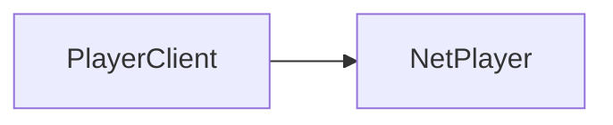

import { InheritedComponent } from '../../src/components/InheritedComponent';

# PlayerClient

A player's client instance. Inherits from the shared [PlayerClient](/shared-api/playerclient) class.

## Player Class Hierarchy

The diagram shows the inheritance hierarchy of player-related classes. To navigate between classes:
- Get a `PlayerClient`
- Get the `NetPlayer` from a `PlayerClient` using `:GetNetPlayer()`

## Class Instance Methods

<InheritedComponent className="PlayerClient_Server" />
