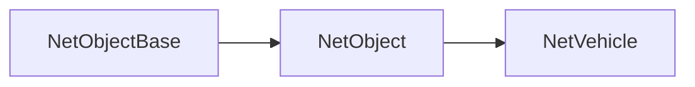

# NetVehicle

Network representation of a vehicle in the game. NetVehicle inherits from [`NetObject`](/shared-api/netobject) and provides vehicle-specific functionality.

## Class Hierarchy



## Instance Methods

### Vehicle Information Methods

#### `NetVehicle:GetId(): number`

Returns the ID of the vehicle.

**Returns:** number - The unique ID of the vehicle

**Example:**
```lua
local vehicleId = vehicle:GetId()
print("Vehicle ID: " .. vehicleId)
```

#### `NetVehicle:GetVelocity(): vec3`

Gets the vector3 velocity of the vehicle.

**Returns:** vec3 - The velocity vector of the vehicle

**Example:**
```lua
local velocity = vehicle:GetVelocity()
print("Vehicle velocity: " .. tostring(velocity))
```

### Vehicle State Methods

#### `NetVehicle:IsWheelDrifting(wheel: number, threshold: number): boolean`

Returns true if the specified wheel is currently drifting, false otherwise. Wheel is the index of the wheel to check, and threshold is the threshold where it returns true. Threshold should be a value between 0 and 1 where a low value will detect drifting more easily.

**Parameters:**
- `wheel: number` - The index of the wheel to check (0-based)
- `threshold: number` - The threshold for detecting drift (0-1)

**Returns:** boolean - true if the wheel is drifting, false otherwise

**Example:**
```lua
local isDrifting = vehicle:IsWheelDrifting(0, 0.5)
if isDrifting then
    print("Front wheel is drifting!")
end
```

#### `NetVehicle:GetNumberOfWheelsOnGround(): number`

Returns the number of wheels of the vehicle that are currently touching the ground.

**Returns:** number - The number of wheels on the ground

**Example:**
```lua
local wheelsOnGround = vehicle:GetNumberOfWheelsOnGround()
print("Wheels on ground: " .. wheelsOnGround)
```

### Visual Effect Methods

#### `NetVehicle:SetCloak(enabled: bool): void`

Enables or disables cloaked mode. When cloaked mode is enabled, the vehicle will become mostly invisible with a shine on them.

**Parameters:**
- `enabled: bool` - Whether to enable or disable cloaked mode

**Example:**
```lua
-- Enable cloaked mode
vehicle:SetCloak(true)

-- Disable cloaked mode
vehicle:SetCloak(false)
```

## Related Events

NetVehicles are involved in several vehicle-related events:

### Shared Events
- [`OnVehicleDestroy`](/shared-api/events) - Fired when a vehicle is destroyed
- [`OnVehicleDamage`](/shared-api/events) - Fired when a vehicle takes damage

### Client Events  
- [`OnVehicleExplode`](/client-api/events) - Fired when a vehicle explodes (client-side only)

## Usage Example

```lua
-- Example: Handle vehicle damage event
Event.Add("OnVehicleDamage", function(vehicle, damager, loss, hitbone, weaponHash, hitposition)
    print("Vehicle took " .. loss .. " damage")
    print("Vehicle position: " .. tostring(vehicle:GetPosition()))
    
    -- Check if it's low health
    if vehicle:GetHealth() < 100 then
        print("Vehicle is critically damaged!")
    end
end)
```

## Related Classes

- [`NetObject`](/shared-api/netobject) - Parent class
- [`NetObjectBase`](/shared-api/netobjectbase) - Base network object class 