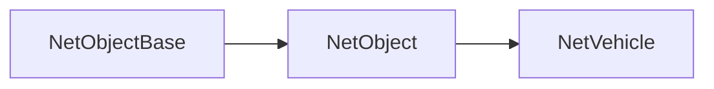

import { InheritedComponent } from '../../src/components/InheritedComponent';

# NetVehicle

Network representation of a vehicle in the game. NetVehicle inherits from [`NetObject`](/shared-api/netobject) and provides vehicle-specific functionality.

## Class Hierarchy



## Instance Methods

<InheritedComponent className="NetVehicle" />

## Related Events

NetVehicles are involved in several vehicle-related events:

### Shared Events
- [`OnVehicleDestroy`](/shared-api/events) - Fired when a vehicle is destroyed
- [`OnVehicleDamage`](/shared-api/events) - Fired when a vehicle takes damage

### Client Events  
- [`OnVehicleExplode`](/client-api/events) - Fired when a vehicle explodes (client-side only)

## Usage Example

```lua
-- Example: Handle vehicle damage event
Event.Add("OnVehicleDamage", function(vehicle, damager, loss, hitbone, weaponHash, hitposition)
    print("Vehicle took " .. loss .. " damage")
    print("Vehicle position: " .. tostring(vehicle:GetPosition()))
    
    -- Check if it's low health
    if vehicle:GetHealth() < 100 then
        print("Vehicle is critically damaged!")
    end
end)
```

## Related Classes

- [`NetObject`](/shared-api/netobject) - Parent class
- [`NetObjectBase`](/shared-api/netobjectbase) - Base network object class 